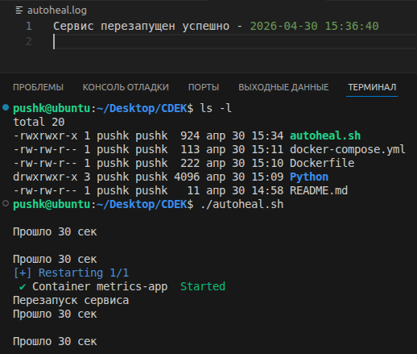

# CDEK_SRE

## Каĸие ещё метриĸи (ĸроме http_requests_total и http_errors_total ) вы бы добавили для этого сервиса в production? //Назовите 3–5 метриĸ.

Для этого сервиса я бы добавил следующие метрики:

1. http_request_duration_seconds - время ответа в секундах //
   Данная метрика позволит оценить насколько быстро отвечает сервис.//
   Позволяет заметить деградацию производительности. После чего можно обратить внимание на другие метрики,//
   которыми вызвана эта причина.

2. http_request_total_by_endpoint - количество запросов на каждый эндпоинт. Это позволяет понять, какие конечные точки API наиболее востребованы и как распределяется нагрузка между разными частями приложения. Благодаря этой метрике можно кешировать наиболее популярные данные, оптимизировать загруженные маршруты, анализировать популярность функций сервиса, спланировать ресурсы и масштабирование.

3. http_requests_per_second - количество запросов в секунду. Позволяет выделить пиковые нагрузки на сервис, спланировать ресурсы

4. cache_hit_ratio - процент попаданий в кэш. Позволит оценить эффективность кеширования. По этой метрике можно определить как и какие пользователи взаимодействуют с сервисом. Для постоянных пользователей высокий процент попаданий, означает что они регулярно возвращаются и запрашивают одни и те же данные. Для новых пользователей низкий процент попаданий объясняется тем, что они впервые знакомятся с контентом, запрашивают уникальную информацию.

## Каĸ вы проверили, что при падении ĸонтейнера он автоматичесĸи восстанавливается?Напишите ĸоманду, ĸоторой вы имитировали падение, и приложите результат (сĸриншот или выдержĸу из лога).

1. Для имитации падения контейнера была выполена команда docker stop <container_id>
   

2. Логи autoheal.log
   

## SLI/SLO

Выберу SLI - доступность сервиса. Для данного сервиса выберу SLO 99.5%, так как в сервисе нет критической бизнес логики и работы с финансами. Большее SLO было бы избыточным. В среднем в месяце 30 дней 30*24*0,005 = 3.6 часа/месяц.

## Постмортем (postmortem). Опишите гипотетичесĸий инцидент: «Сервис не отвечал 15 минут из-за утечĸи памяти».

1. Причина: В сервисе обнаружена утечка памяти (открытые сокеты), которая за 14 дней привела к достижению лимита физ памяти и аварийной остановке процесса OOM Killer.
2. Как обнаружили: Если не были настроены алерты, то по жалобам пользователей. Далее производится базовая диагностика сервиса. Ping сервера(хоста) на котором располагается сервис. Попытка получить GET ответ через curl. Проверка, жив ли сервис через ps aux | grep <>(выше было сказано,что процесс убит oom killer, но возможно есть автоматические перезапуск сервиса). Чтение логов сервиса, системы.
3. Как исправили: Ручной перезапуск сервиса и проверка через curl, что сервис отвечает. Проверка клиента, что всё работает.
4. Чтобы не повторилось: Скрипт проверки и автоматического перезапуска сервиса. Настройка сервисных и системных метрик для сервиса. Профилирование и анализа кода(sast, dast инструменты). Настройка лимитов использование памяти сервиса. Настройка дополнительной реплики сервиса и балансировщик nginx, который в случае падения сервиса просто перенаправит трафик.
